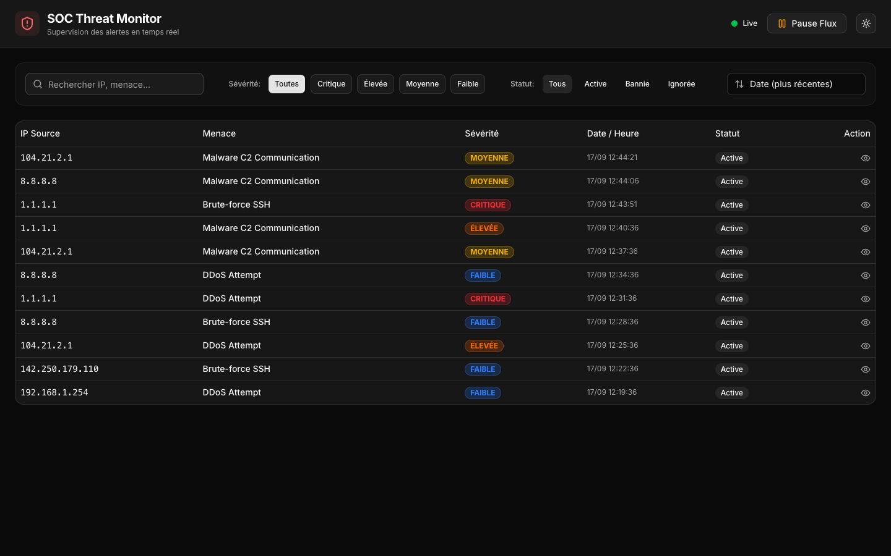
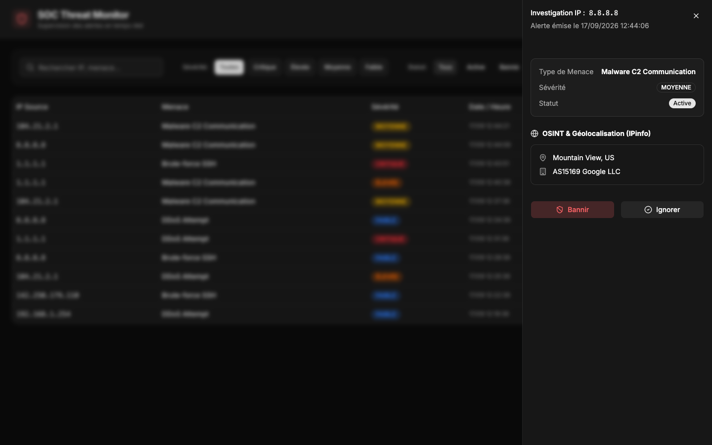
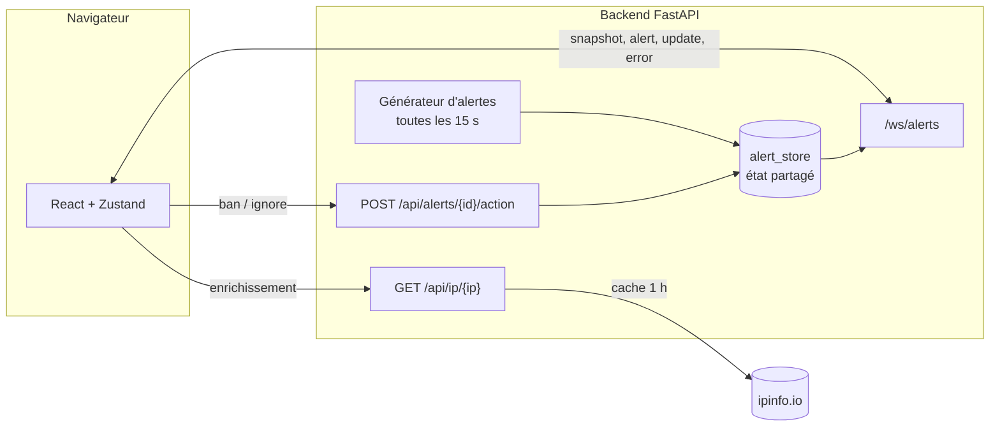

# SOC Threat Monitor

[](https://github.com/e-maccioni26/realtime-soc-dashboard/actions/workflows/ci.yml)


Tableau de bord temps réel pour analystes SOC. Les alertes de sécurité arrivent en continu par WebSocket, chaque IP source peut être enrichie (géolocalisation, fournisseur) puis bannie ou ignorée. Toutes les personnes connectées voient les mêmes données et les mêmes décisions, sans rechargement.



| Investigation d'une IP |
| --- |
|  |

## Fonctionnalités

- Flux d'alertes en direct, avec une animation d'arrivée colorée selon la sévérité.
- Filtres par sévérité et par statut, recherche par IP ou type de menace, six tris.
- Panneau d'investigation : ville, pays et fournisseur de l'IP via IPinfo. Les IP privées sont reconnues et ne déclenchent aucun appel externe.
- Bannir une IP met à jour toutes ses alertes, y compris celles qui arriveront ensuite. Ignorer ne concerne qu'une alerte.
- Mise en pause du flux : les alertes reçues pendant la pause sont gardées et comptées ("Reprendre (3)"), puis affichées à la reprise.
- Reconnexion automatique avec délai croissant (1 s, 2 s, 4 s… jusqu'à 30 s). À la reconnexion, le client récupère tout ce qu'il a manqué.
- Pannes simulées de la source de logs (429, 500, 502, 503 sur environ 15 % des cycles), affichées en toast sans interrompre le flux.
- Thème clair ou sombre, navigation au clavier dans le tableau.

## Architecture



Le backend garde une seule copie de l'état. Le front ne fait qu'en afficher le reflet, ce qui évite les divergences entre onglets.

### Protocole WebSocket

| Message | Envoyé quand | Contenu |
| --- | --- | --- |
| `snapshot` | à chaque connexion ou reconnexion | toutes les alertes, de la plus récente à la plus ancienne |
| `alert` | une nouvelle alerte est ingérée | l'alerte |
| `update` | un analyste bannit ou ignore | les alertes dont le statut a changé |
| `error` | la source de logs simulée échoue | `status_code` et `message` |

Côté client, tous ces messages passent par une seule fonction du store, `upsertAlerts`. Une alerte déjà connue est mise à jour sur place, une nouvelle est ajoutée ou mise en attente si le flux est en pause. Rejouer deux fois le même message ne change rien.

## Sécurité

- **CORS et WebSocket** : seules les origines de `ALLOWED_ORIGINS` sont acceptées. L'en-tête `Origin` est vérifié à l'ouverture du WebSocket, car CORS ne protège pas ce canal.
- **Validation** : les messages WebSocket sont vérifiés côté client avant d'entrer dans le store. Un message mal formé est ignoré au lieu de faire planter l'interface. Côté serveur, les identifiants doivent être des UUID et les IP sont validées avec `ipaddress`.
- **IPinfo via le backend** : le token reste sur le serveur et le fournisseur ne voit jamais l'IP de l'analyste. Seuls quelques champs texte sont renvoyés au navigateur.
- **Limitation de débit** : 30 requêtes par minute par IP sur les routes REST.
- **En-têtes HTTP** (image nginx) : Content-Security-Policy stricte (`script-src 'self'`), `X-Content-Type-Options`, `Referrer-Policy`, `Permissions-Policy`, `frame-ancestors 'none'`.
- **Conteneurs** : le backend tourne avec un utilisateur sans privilèges.

## Lancer le projet

### Avec Docker

```bash
docker compose up --build
```

Le tableau de bord est sur http://localhost:8080 et l'API sur http://localhost:8000.

### En local

Backend (Python 3.11) :

```bash
cd backend
python3 -m venv venv
source venv/bin/activate
pip install -r requirements-dev.txt
uvicorn main:app --reload --port 8000 --ws-max-size 4096
```

Frontend (Node 20.19 ou plus) :

```bash
cd frontend
npm install
npm run dev
```

L'application est sur http://localhost:5173.

### Variables d'environnement

| Variable | Côté | Défaut | Rôle |
| --- | --- | --- | --- |
| `ALLOWED_ORIGINS` | backend | `http://localhost:5173,http://localhost:4173` | origines autorisées (CORS et WebSocket) |
| `IPINFO_TOKEN` | backend | vide | augmente le quota IPinfo, facultatif |
| `VITE_API_URL` | frontend (build) | `http://localhost:8000` | URL de l'API |
| `VITE_WS_URL` | frontend (build) | déduite de `VITE_API_URL` | URL du WebSocket |
| `CSP_CONNECT_SRC` | image nginx | `http://localhost:8000 ws://localhost:8000` | origines autorisées par la CSP |

## Tests et CI

```bash
cd backend && pytest -q
cd frontend && npm test
```

- **Backend (pytest)** : contrôle de l'origine WebSocket, CORS, validation des entrées, limite de débit, proxy IPinfo (IP privées, filtrage, cache), règles de bannissement et diffusion des mises à jour.
- **Frontend (Vitest)** : validation des messages, doublons, mise en pause, rattrapage après reconnexion, plafond mémoire.

GitHub Actions lance lint, tests et build pour chaque partie, puis construit les images Docker.

## Stack technique

| | |
| --- | --- |
| Frontend | React 19, TypeScript, Vite, Zustand, TanStack Query, react-use-websocket, Tailwind CSS v4, shadcn/ui |
| Backend | FastAPI, Pydantic, Uvicorn |
| Outillage | Vitest, pytest, ESLint, Docker, nginx, GitHub Actions |

Zustand gère le flux d'alertes, mis à jour très souvent, avec des sélecteurs fins pour limiter les rendus. TanStack Query sert uniquement à l'enrichissement IP, où le cache et les états de chargement apportent quelque chose.

## Structure

```
backend/
  main.py            routes REST, WebSocket, diffusion, CORS, limite de débit
  alert_store.py     état partagé et règles métier (ban, ignore)
  alert_service.py   génération des alertes simulées et des pannes
  ipinfo.py          proxy IPinfo avec validation et cache
frontend/src/
  hooks/             useAlertWebSocket, useIpInfo
  store/             useAlertStore (Zustand)
  lib/               validation des messages, tri, libellés, configuration
  components/        tableau, filtres, panneau d'investigation, ErrorBoundary
```

## Limites connues

- L'état est en mémoire : un redémarrage du backend repart de zéro. Tout l'accès aux données passe par `alert_store.py`, ce qui permet de brancher SQLite ou PostgreSQL sans toucher au reste.
- Pas d'authentification. Les actions sont ouvertes à quiconque atteint l'API, ce qui convient à une démo mais pas à un usage réel.
- Le tableau garde 500 alertes au maximum. Au-delà, il faudrait virtualiser la liste.
- La limite de débit est tenue en mémoire, par processus. Derrière plusieurs instances, il faudrait la déplacer dans Redis.

## Licence

[MIT](LICENSE)
